# Analysis Report: Network Dataset

Generated: 2026-01-21 07:57:32

---

## 📊 Model Leaderboard

Ranked by F1 (macro) score on test set.

| Rank | Experiment Name | Accuracy | F1 (macro) | Balanced Acc | MCC | Time (s) |
|------|---|---|---|---|---|---|
| 1 | `2026-01-14_23-14-58_network_small_random_forest` | 0.8760 | 0.8688 | 0.9592 | 0.5627 | 43.0 |
| 2 | `2026-01-15_00-55-56_network_small_knn` | 0.8990 | 0.8368 | 0.8442 | 0.3495 | 5.3 |
| 3 | `2026-01-15_00-11-13_network_small_ft_transformer` | 0.8552 | 0.7743 | 0.9598 | 0.5401 | 2673.9 |
| 4 | `2026-01-14_23-01-53_network_small_mlp` | 0.8510 | 0.7718 | 0.9585 | 0.5333 | 745.1 |
| 5 | `2026-01-21_06-16-44_network_large_random_forest` | 0.7854 | 0.7490 | 0.9382 | 0.6018 | 744.8 |
| 6 | `2026-01-15_01-05-22_network_small_tab_transformer` | 0.4656 | 0.7042 | 0.8548 | 0.2300 | 2786.7 |
| 7 | `2026-01-20_20-35-56_network_medium_xgboost` | 0.7113 | 0.6961 | 0.9279 | 0.4693 | 680.7 |
| 8 | `2026-01-20_21-05-35_network_medium_random_forest` | 0.7058 | 0.6843 | 0.8724 | 0.4665 | 756.0 |
| 9 | `2026-01-21_06-30-17_network_medium_random_forest` | 0.7058 | 0.6843 | 0.8724 | 0.4665 | 641.2 |
| 10 | `2026-01-21_03-38-32_network_large_knn` | 0.8708 | 0.6672 | 0.6907 | 0.5412 | 4.3 |
| 11 | `2026-01-14_23-39-12_network_small_xgboost` | 0.8663 | 0.6134 | 0.7095 | 0.5515 | 26.5 |
| 12 | `2026-01-14_23-49-15_network_small_attention_mlp` | 0.6476 | 0.5953 | 0.8121 | 0.1380 | 1308.3 |
| 13 | `2026-01-20_20-48-35_network_medium_knn` | 0.8589 | 0.5909 | 0.5706 | 0.2198 | 18.4 |
| 14 | `2026-01-21_04-08-05_network_medium_knn` | 0.8589 | 0.5909 | 0.5706 | 0.2198 | 17.3 |
| 15 | `2026-01-20_23-22-03_network_medium_attention_mlp` | 0.7089 | 0.5452 | 0.7450 | 0.4650 | 161.1 |
| 16 | `2026-01-20_23-44-20_network_large_attention_mlp` | 0.7700 | 0.4577 | 0.6085 | 0.5831 | 2889.7 |
| 17 | `2026-01-20_23-21-19_network_medium_mlp` | 0.6955 | 0.4523 | 0.7653 | 0.4563 | 24.8 |
| 18 | `2026-01-20_23-29-47_network_medium_ft_transformer` | 0.7108 | 0.4457 | 0.6015 | 0.4658 | 385.7 |
| 19 | `2026-01-20_23-25-00_network_medium_tab_transformer` | 0.8820 | 0.3215 | 0.3307 | 0.1420 | 268.6 |
| 20 | `2026-01-21_04-24-57_network_large_mlp` | 0.4899 | 0.2944 | 0.4081 | 0.3221 | 2994.4 |

---

## 🎯 Hard Classes Analysis

Classes with highest error rates across all models.

| Class | Total | Errors | Error Rate |
|-------|-------|--------|------------|
| scan | 54 | 26 | 48.15% |
| anomaly | 260 | 91 | 35.00% |
| MITM | 441731 | 148721 | 33.67% |
| physical fault | 348180 | 88715 | 25.48% |
| normal | 6417477 | 1568317 | 24.44% |
| DoS | 142298 | 1555 | 1.09% |

---

## 🔍 Hardest Samples

Samples misclassified by most models (top 20).

| Sample | True Label | Times Wrong | Common Prediction |
|--------|------------|-------------|-------------------|
| 223176 | normal | 19 | physical fault |
| 191107 | normal | 19 | MITM |
| 47895 | normal | 19 | physical fault |
| 157312 | normal | 19 | MITM |
| 189488 | normal | 19 | MITM |
| 159837 | normal | 19 | physical fault |
| 158652 | normal | 19 | physical fault |
| 17761 | normal | 19 | MITM |
| 25209 | normal | 19 | MITM |
| 174170 | normal | 19 | MITM |
| 84008 | normal | 18 | physical fault |
| 68339 | normal | 18 | MITM |
| 153063 | normal | 18 | MITM |
| 149053 | normal | 18 | physical fault |
| 86878 | normal | 18 | physical fault |
| 78176 | normal | 18 | physical fault |
| 182334 | normal | 18 | MITM |
| 153519 | normal | 18 | MITM |
| 123353 | normal | 18 | MITM |
| 128459 | normal | 18 | physical fault |

---

## 🔗 Model Error Correlation

Which models make similar mistakes? (Jaccard similarity of error sets)

**Correlation Matrix:**

| Model | large_knn | small_knn | medium_knn | large_mlp | small_mlp | medium_mlp | large_attention_mlp | small_attention_mlp | medium_attention_mlp | small_tab_transformer | medium_tab_transformer | small_ft_transformer | medium_ft_transformer | large_random_forest | small_random_forest | medium_random_forest | small_xgboost | medium_xgboost |
|-------|---|---|---|---|---|---|---|---|---|---|---|---|---|---|---|---|---|---|
| large_knn | 1.00 | 0.03 | 0.05 | 0.19 | 0.04 | 0.08 | 0.19 | 0.07 | 0.08 | 0.09 | 0.05 | 0.04 | 0.08 | 0.20 | 0.03 | 0.08 | 0.03 | 0.08 |
| small_knn | 0.03 | 1.00 | 0.05 | 0.04 | 0.31 | 0.05 | 0.03 | 0.11 | 0.05 | 0.10 | 0.05 | 0.31 | 0.05 | 0.03 | 0.34 | 0.05 | 0.33 | 0.05 |
| medium_knn | 0.05 | 0.05 | 1.00 | 0.08 | 0.06 | 0.12 | 0.07 | 0.09 | 0.12 | 0.10 | 0.57 | 0.05 | 0.12 | 0.06 | 0.05 | 0.12 | 0.05 | 0.12 |
| large_mlp | 0.19 | 0.04 | 0.08 | 1.00 | 0.05 | 0.16 | 0.45 | 0.12 | 0.15 | 0.17 | 0.07 | 0.05 | 0.15 | 0.41 | 0.04 | 0.16 | 0.05 | 0.15 |
| small_mlp | 0.04 | 0.31 | 0.06 | 0.05 | 1.00 | 0.07 | 0.04 | 0.20 | 0.07 | 0.27 | 0.05 | 0.92 | 0.07 | 0.04 | 0.80 | 0.07 | 0.87 | 0.07 |
| medium_mlp | 0.08 | 0.05 | 0.12 | 0.16 | 0.07 | 1.00 | 0.12 | 0.14 | 0.95 | 0.19 | 0.01 | 0.07 | 0.94 | 0.11 | 0.06 | 0.96 | 0.07 | 0.94 |
| large_attention_mlp | 0.19 | 0.03 | 0.07 | 0.45 | 0.04 | 0.12 | 1.00 | 0.09 | 0.11 | 0.12 | 0.06 | 0.04 | 0.11 | 0.87 | 0.04 | 0.11 | 0.04 | 0.11 |
| small_attention_mlp | 0.07 | 0.11 | 0.09 | 0.12 | 0.20 | 0.14 | 0.09 | 1.00 | 0.14 | 0.39 | 0.08 | 0.20 | 0.14 | 0.09 | 0.18 | 0.14 | 0.19 | 0.14 |
| medium_attention_mlp | 0.08 | 0.05 | 0.12 | 0.15 | 0.07 | 0.95 | 0.11 | 0.14 | 1.00 | 0.18 | 0.01 | 0.07 | 0.94 | 0.11 | 0.06 | 0.96 | 0.07 | 0.95 |
| small_tab_transformer | 0.09 | 0.10 | 0.10 | 0.17 | 0.27 | 0.19 | 0.12 | 0.39 | 0.18 | 1.00 | 0.09 | 0.27 | 0.18 | 0.11 | 0.23 | 0.18 | 0.25 | 0.18 |
| medium_tab_transformer | 0.05 | 0.05 | 0.57 | 0.07 | 0.05 | 0.01 | 0.06 | 0.08 | 0.01 | 0.09 | 1.00 | 0.05 | 0.01 | 0.06 | 0.05 | 0.00 | 0.05 | 0.01 |
| small_ft_transformer | 0.04 | 0.31 | 0.05 | 0.05 | 0.92 | 0.07 | 0.04 | 0.20 | 0.07 | 0.27 | 0.05 | 1.00 | 0.07 | 0.04 | 0.82 | 0.07 | 0.89 | 0.07 |
| medium_ft_transformer | 0.08 | 0.05 | 0.12 | 0.15 | 0.07 | 0.94 | 0.11 | 0.14 | 0.94 | 0.18 | 0.01 | 0.07 | 1.00 | 0.11 | 0.06 | 0.95 | 0.07 | 0.95 |
| large_random_forest | 0.20 | 0.03 | 0.06 | 0.41 | 0.04 | 0.11 | 0.87 | 0.09 | 0.11 | 0.11 | 0.06 | 0.04 | 0.11 | 1.00 | 0.04 | 0.11 | 0.04 | 0.11 |
| small_random_forest | 0.03 | 0.34 | 0.05 | 0.04 | 0.80 | 0.06 | 0.04 | 0.18 | 0.06 | 0.23 | 0.05 | 0.82 | 0.06 | 0.04 | 1.00 | 0.06 | 0.88 | 0.06 |
| medium_random_forest | 0.08 | 0.05 | 0.12 | 0.16 | 0.07 | 0.96 | 0.11 | 0.14 | 0.96 | 0.18 | 0.00 | 0.07 | 0.95 | 0.11 | 0.06 | 1.00 | 0.07 | 0.96 |
| small_xgboost | 0.03 | 0.33 | 0.05 | 0.05 | 0.87 | 0.07 | 0.04 | 0.19 | 0.07 | 0.25 | 0.05 | 0.89 | 0.07 | 0.04 | 0.88 | 0.07 | 1.00 | 0.07 |
| medium_xgboost | 0.08 | 0.05 | 0.12 | 0.15 | 0.07 | 0.94 | 0.11 | 0.14 | 0.95 | 0.18 | 0.01 | 0.07 | 0.95 | 0.11 | 0.06 | 0.96 | 0.07 | 1.00 |

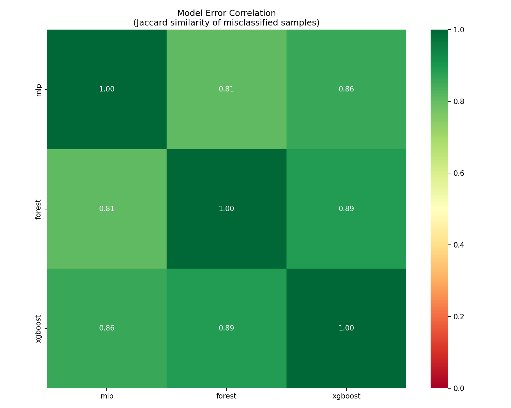

---

## 📈 Training Curves

### 2026-01-14_23-01-53_network_small_mlp

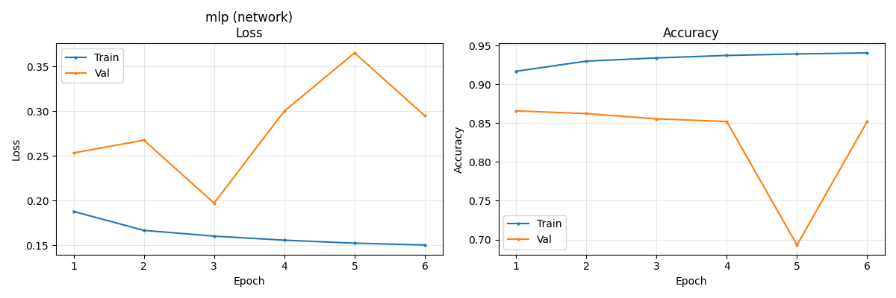

### 2026-01-14_23-14-58_network_small_random_forest

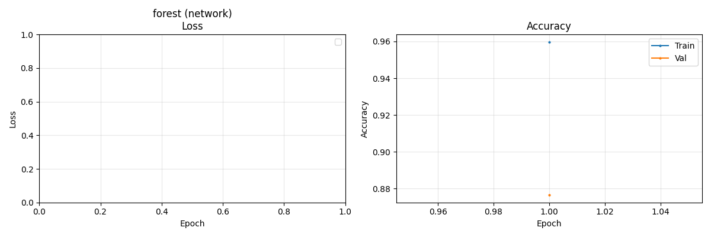

### 2026-01-14_23-39-12_network_small_xgboost

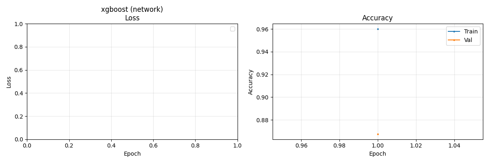

### 2026-01-14_23-49-15_network_small_attention_mlp

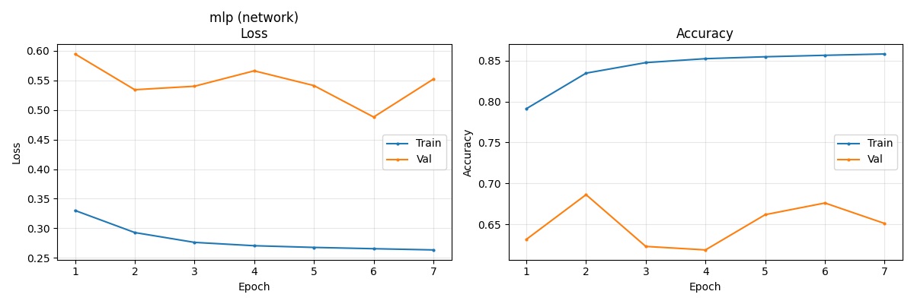

### 2026-01-15_00-11-13_network_small_ft_transformer

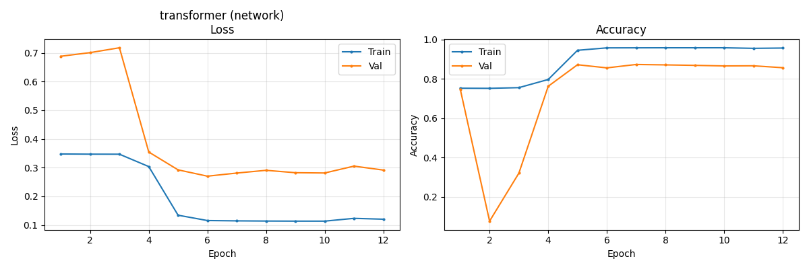

### 2026-01-15_00-55-56_network_small_knn

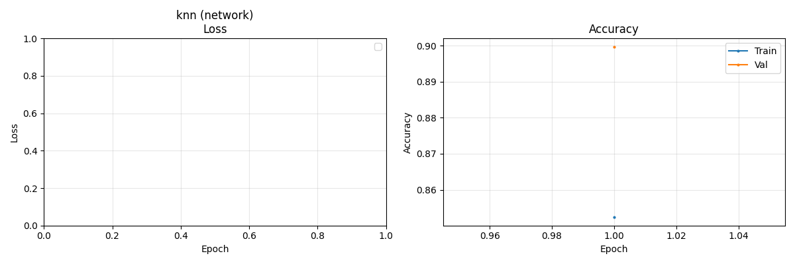

### 2026-01-15_01-05-22_network_small_tab_transformer

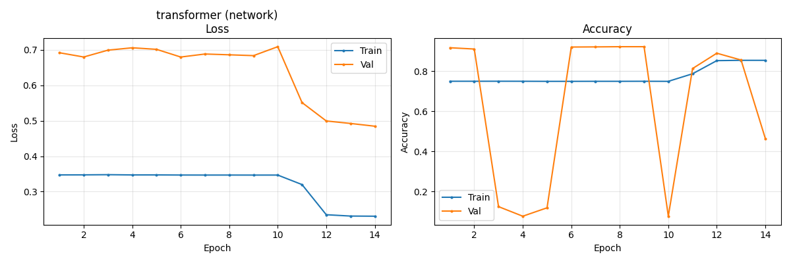

### 2026-01-20_20-35-56_network_medium_xgboost

### 2026-01-20_20-48-35_network_medium_knn

### 2026-01-20_21-05-35_network_medium_random_forest

### 2026-01-20_23-21-19_network_medium_mlp

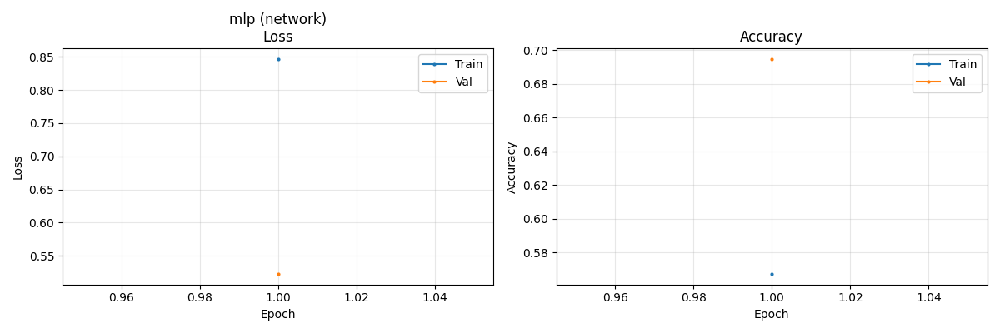

### 2026-01-20_23-22-03_network_medium_attention_mlp

### 2026-01-20_23-25-00_network_medium_tab_transformer

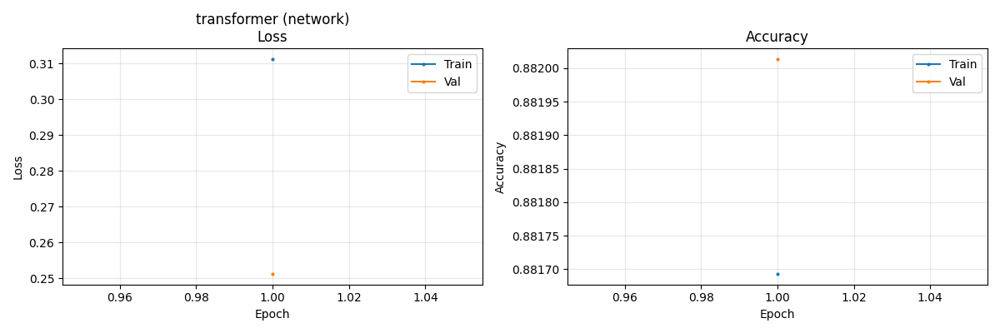

### 2026-01-20_23-29-47_network_medium_ft_transformer

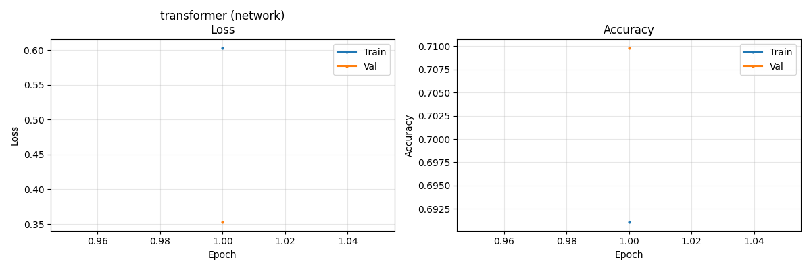

### 2026-01-20_23-44-20_network_large_attention_mlp

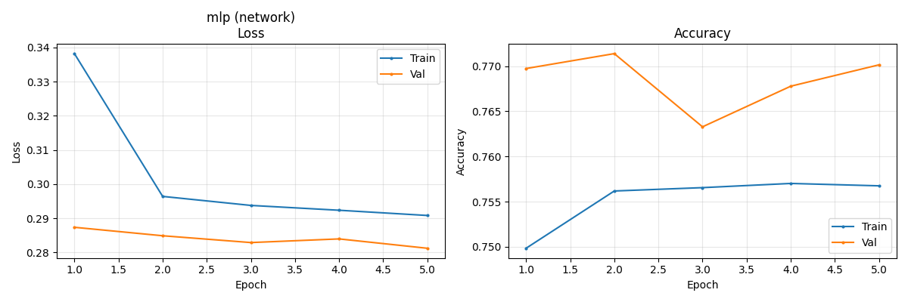

### 2026-01-21_03-38-32_network_large_knn

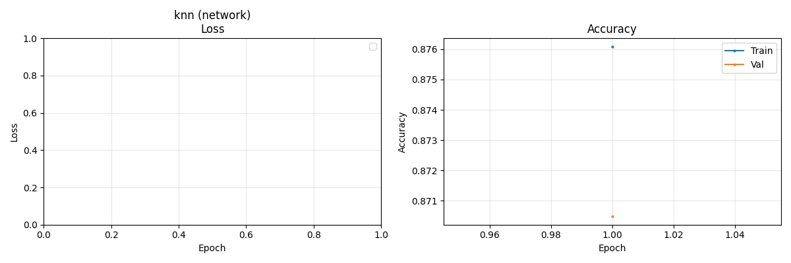

### 2026-01-21_04-08-05_network_medium_knn

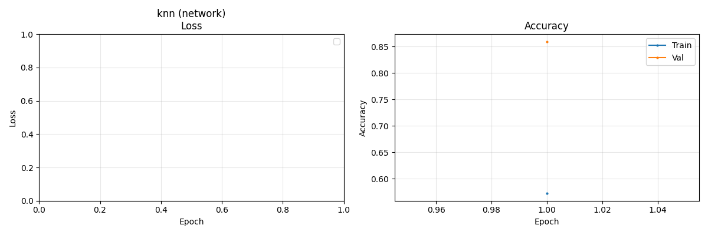

### 2026-01-21_04-24-57_network_large_mlp

### 2026-01-21_06-16-44_network_large_random_forest

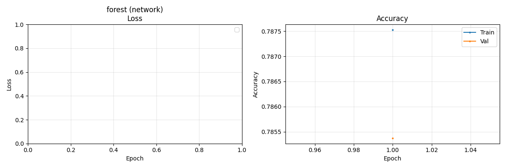

### 2026-01-21_06-30-17_network_medium_random_forest

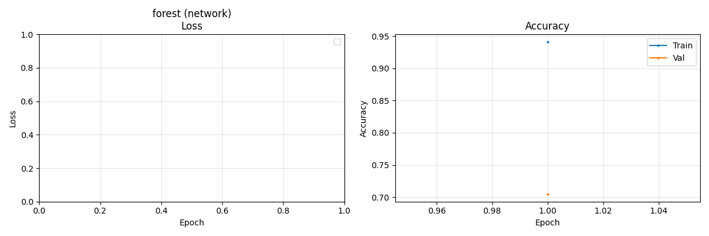

