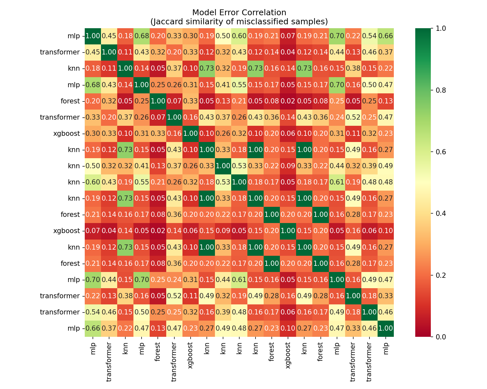
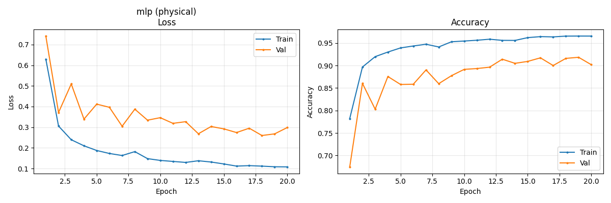
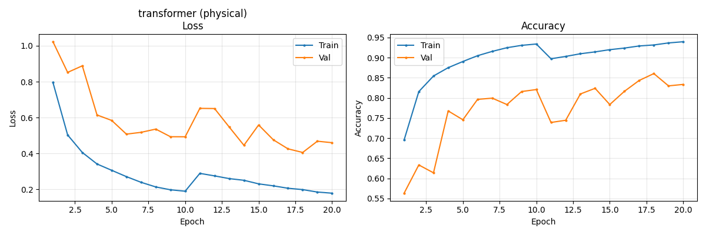
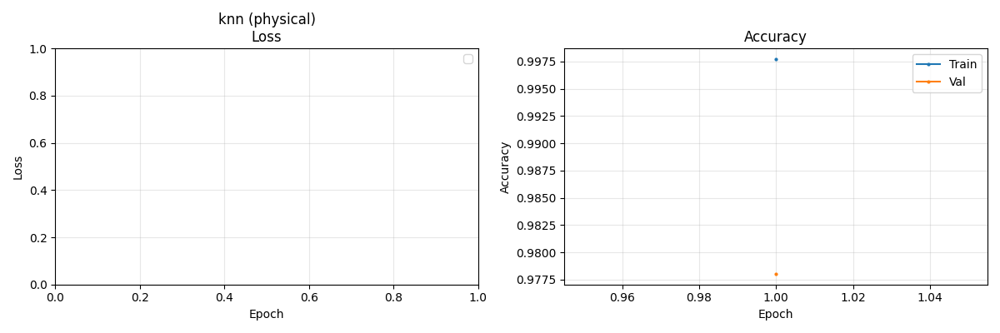
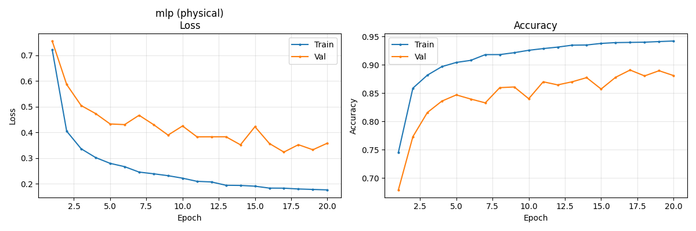
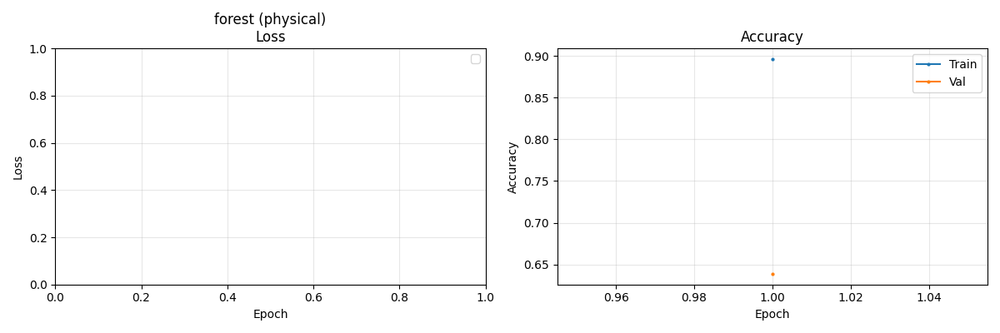
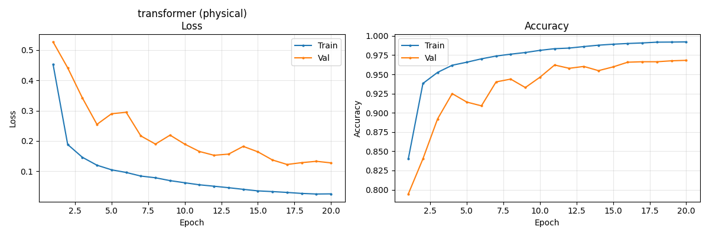
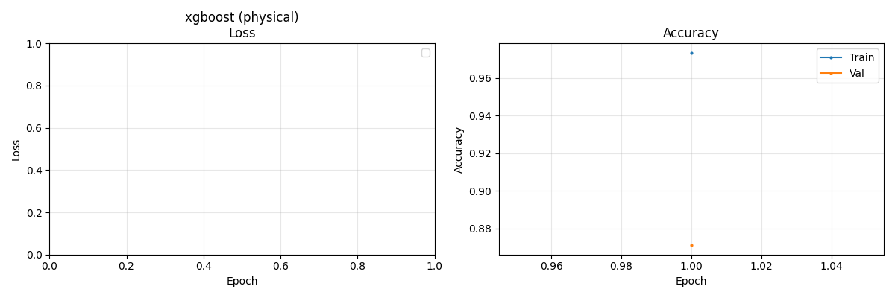

# Analysis Report: Physical Dataset

Generated: 2026-01-15 07:24:18

---

## 📊 Model Leaderboard

Ranked by F1 (macro) score on test set.

| Rank | Experiment Name                                      | Accuracy | F1 (macro) | Balanced Acc | MCC    | Time (s) |
| ---- | ---------------------------------------------------- | -------- | ---------- | ------------ | ------ | -------- |
| 1    | `2026-01-14_23-01-46_physical_small_knn`             | 0.9774   | 0.8007     | 0.8235       | 0.9402 | 0.0      |
| 2    | `2026-01-14_23-38-28_physical_small_tab_transformer` | 0.9683   | 0.8001     | 0.8250       | 0.9188 | 40.7     |
| 3    | `2026-01-14_21-23-07_physical_small_attention_mlp`   | 0.9048   | 0.7259     | 0.8106       | 0.7946 | 35.2     |
| 4    | `2026-01-14_23-14-32_physical_small_mlp`             | 0.8786   | 0.6889     | 0.7988       | 0.7515 | 22.7     |
| 5    | `2026-01-14_22-00-45_physical_small_ft_transformer`  | 0.8401   | 0.6593     | 0.7970       | 0.7004 | 56.1     |
| 6    | `2026-01-14_23-39-57_physical_small_xgboost`         | 0.8676   | 0.6412     | 0.7906       | 0.7287 | 0.6      |
| 7    | `2026-01-14_23-16-06_physical_small_random_forest`   | 0.6101   | 0.4687     | 0.7242       | 0.4779 | 0.2      |

---

## 🎯 Hard Classes Analysis

Classes with highest error rates across all models.

| Class          | Total | Errors | Error Rate |
| -------------- | ----- | ------ | ---------- |
| scan           | 14    | 14     | 100.00%    |
| normal         | 9093  | 1501   | 16.51%     |
| MITM           | 1057  | 36     | 3.41%      |
| DoS            | 329   | 4      | 1.22%      |
| nomal          | 259   | 2      | 0.77%      |
| physical fault | 721   | 5      | 0.69%      |

---

## 🔍 Hardest Samples

Samples misclassified by most models (top 20).

| Sample | True Label | Times Wrong | Common Prediction |
| ------ | ---------- | ----------- | ----------------- |
| 5      | normal     | 7           | MITM              |
| 35     | normal     | 7           | MITM              |
| 598    | normal     | 7           | scan              |
| 864    | normal     | 7           | scan              |
| 1257   | normal     | 7           | physical fault    |
| 892    | normal     | 7           | DoS               |
| 1104   | normal     | 7           | MITM              |
| 927    | normal     | 7           | MITM              |
| 848    | normal     | 7           | physical fault    |
| 768    | normal     | 7           | physical fault    |
| 1549   | scan       | 7           | normal            |
| 466    | normal     | 7           | DoS               |
| 36     | scan       | 7           | normal            |
| 210    | normal     | 7           | MITM              |
| 1203   | normal     | 7           | scan              |
| 1559   | normal     | 7           | physical fault    |
| 1628   | normal     | 7           | MITM              |
| 790    | normal     | 6           | scan              |
| 947    | MITM       | 6           | scan              |
| 940    | normal     | 6           | physical fault    |

---

## 🔗 Model Error Correlation

Which models make similar mistakes? (Jaccard similarity of error sets)

**Correlation Matrix:**

| Model       | mlp  | transformer | knn  | mlp  | forest | transformer | xgboost |
| ----------- | ---- | ----------- | ---- | ---- | ------ | ----------- | ------- |
| mlp         | 1.00 | 0.45        | 0.18 | 0.68 | 0.20   | 0.33        | 0.30    |
| transformer | 0.45 | 1.00        | 0.11 | 0.43 | 0.32   | 0.20        | 0.33    |
| knn         | 0.18 | 0.11        | 1.00 | 0.14 | 0.05   | 0.37        | 0.10    |
| mlp         | 0.68 | 0.43        | 0.14 | 1.00 | 0.25   | 0.26        | 0.31    |
| forest      | 0.20 | 0.32        | 0.05 | 0.25 | 1.00   | 0.07        | 0.33    |
| transformer | 0.33 | 0.20        | 0.37 | 0.26 | 0.07   | 1.00        | 0.16    |
| xgboost     | 0.30 | 0.33        | 0.10 | 0.31 | 0.33   | 0.16        | 1.00    |

---

## 📈 Training Curves

### 2026-01-14_21-23-07_physical_small_attention_mlp

### 2026-01-14_22-00-45_physical_small_ft_transformer

### 2026-01-14_23-01-46_physical_small_knn

### 2026-01-14_23-14-32_physical_small_mlp

### 2026-01-14_23-16-06_physical_small_random_forest

### 2026-01-14_23-38-28_physical_small_tab_transformer

### 2026-01-14_23-39-57_physical_small_xgboost

