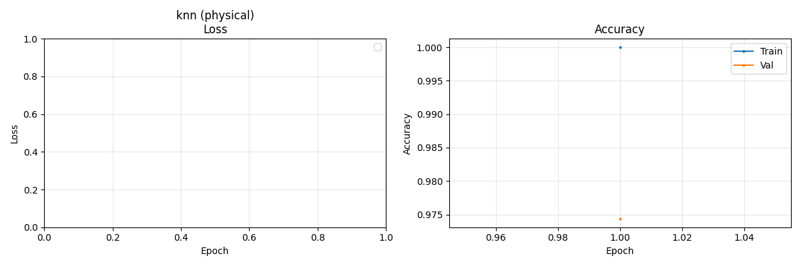
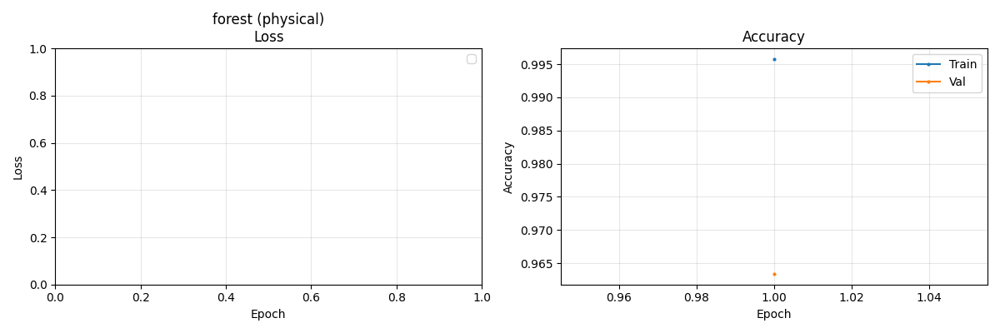
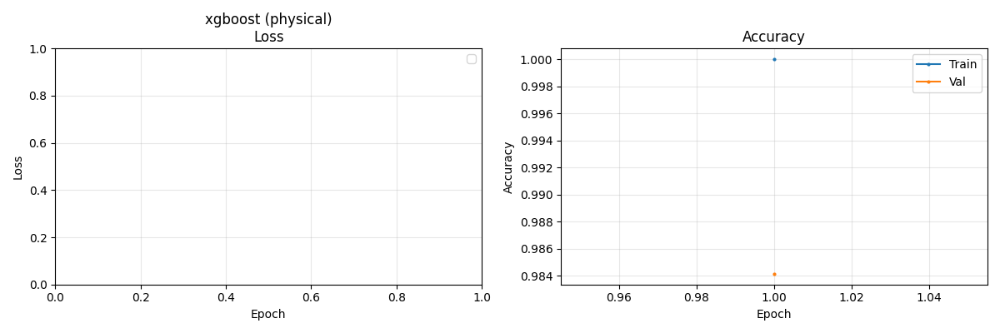

# Analysis Report: Physical Dataset

Generated: 2026-01-15 09:50:54

---

## 📊 Model Leaderboard

Ranked by F1 (macro) score on test set.

| Rank | Experiment Name | Accuracy | F1 (macro) | Balanced Acc | MCC | Time (s) |
|------|---|---|---|---|---|---|
| 1 | `2026-01-15_09-43-58_physical_medium_xgboost` | 0.9872 | 0.8134 | 0.8075 | 0.9641 | 1.7 |
| 2 | `2026-01-15_09-37-32_physical_medium_knn` | 0.9793 | 0.8095 | 0.8249 | 0.9450 | 0.0 |
| 3 | `2026-01-14_23-01-46_physical_small_knn` | 0.9774 | 0.8007 | 0.8235 | 0.9402 | 0.0 |
| 4 | `2026-01-14_23-38-28_physical_small_tab_transformer` | 0.9683 | 0.8001 | 0.8250 | 0.9188 | 40.7 |
| 5 | `2026-01-15_09-41-11_physical_medium_random_forest` | 0.9695 | 0.7936 | 0.8150 | 0.9198 | 0.5 |
| 6 | `2026-01-14_21-23-07_physical_small_attention_mlp` | 0.9048 | 0.7259 | 0.8106 | 0.7946 | 35.2 |
| 7 | `2026-01-14_23-14-32_physical_small_mlp` | 0.8786 | 0.6889 | 0.7988 | 0.7515 | 22.7 |
| 8 | `2026-01-14_22-00-45_physical_small_ft_transformer` | 0.8401 | 0.6593 | 0.7970 | 0.7004 | 56.1 |
| 9 | `2026-01-14_23-39-57_physical_small_xgboost` | 0.8676 | 0.6412 | 0.7906 | 0.7287 | 0.6 |
| 10 | `2026-01-14_23-16-06_physical_small_random_forest` | 0.6101 | 0.4687 | 0.7242 | 0.4779 | 0.2 |

---

## 🎯 Hard Classes Analysis

Classes with highest error rates across all models.

| Class | Total | Errors | Error Rate |
|-------|-------|--------|------------|
| scan | 20 | 20 | 100.00% |
| normal | 12990 | 1583 | 12.19% |
| MITM | 1510 | 43 | 2.85% |
| nomal | 370 | 7 | 1.89% |
| DoS | 470 | 6 | 1.28% |
| physical fault | 1030 | 8 | 0.78% |

---

## 🔍 Hardest Samples

Samples misclassified by most models (top 20).

| Sample | True Label | Times Wrong | Common Prediction |
|--------|------------|-------------|-------------------|
| 36 | scan | 10 | normal |
| 768 | normal | 10 | physical fault |
| 1257 | normal | 10 | physical fault |
| 927 | normal | 10 | MITM |
| 848 | normal | 10 | physical fault |
| 1549 | scan | 10 | normal |
| 34 | normal | 9 | MITM |
| 1104 | normal | 9 | MITM |
| 1628 | normal | 9 | MITM |
| 35 | normal | 9 | MITM |
| 5 | normal | 9 | MITM |
| 210 | normal | 9 | MITM |
| 99 | normal | 8 | MITM |
| 1203 | normal | 8 | scan |
| 1559 | normal | 8 | physical fault |
| 864 | normal | 8 | scan |
| 466 | normal | 8 | DoS |
| 160 | normal | 8 | MITM |
| 113 | normal | 8 | MITM |
| 892 | normal | 8 | DoS |

---

## 🔗 Model Error Correlation

Which models make similar mistakes? (Jaccard similarity of error sets)

**Correlation Matrix:**

| Model | mlp | transformer | knn | mlp | forest | transformer | xgboost | knn | forest | xgboost |
|-------|---|---|---|---|---|---|---|---|---|---|
| mlp | 1.00 | 0.45 | 0.18 | 0.68 | 0.20 | 0.33 | 0.30 | 0.19 | 0.21 | 0.07 |
| transformer | 0.45 | 1.00 | 0.11 | 0.43 | 0.32 | 0.20 | 0.33 | 0.12 | 0.14 | 0.04 |
| knn | 0.18 | 0.11 | 1.00 | 0.14 | 0.05 | 0.37 | 0.10 | 0.73 | 0.16 | 0.14 |
| mlp | 0.68 | 0.43 | 0.14 | 1.00 | 0.25 | 0.26 | 0.31 | 0.15 | 0.17 | 0.05 |
| forest | 0.20 | 0.32 | 0.05 | 0.25 | 1.00 | 0.07 | 0.33 | 0.05 | 0.08 | 0.02 |
| transformer | 0.33 | 0.20 | 0.37 | 0.26 | 0.07 | 1.00 | 0.16 | 0.43 | 0.36 | 0.14 |
| xgboost | 0.30 | 0.33 | 0.10 | 0.31 | 0.33 | 0.16 | 1.00 | 0.10 | 0.20 | 0.06 |
| knn | 0.19 | 0.12 | 0.73 | 0.15 | 0.05 | 0.43 | 0.10 | 1.00 | 0.20 | 0.15 |
| forest | 0.21 | 0.14 | 0.16 | 0.17 | 0.08 | 0.36 | 0.20 | 0.20 | 1.00 | 0.20 |
| xgboost | 0.07 | 0.04 | 0.14 | 0.05 | 0.02 | 0.14 | 0.06 | 0.15 | 0.20 | 1.00 |

---

## 📈 Training Curves

### 2026-01-14_21-23-07_physical_small_attention_mlp

### 2026-01-14_22-00-45_physical_small_ft_transformer

### 2026-01-14_23-01-46_physical_small_knn

### 2026-01-14_23-14-32_physical_small_mlp

### 2026-01-14_23-16-06_physical_small_random_forest

### 2026-01-14_23-38-28_physical_small_tab_transformer

### 2026-01-14_23-39-57_physical_small_xgboost

### 2026-01-15_09-37-32_physical_medium_knn

### 2026-01-15_09-41-11_physical_medium_random_forest

### 2026-01-15_09-43-58_physical_medium_xgboost

